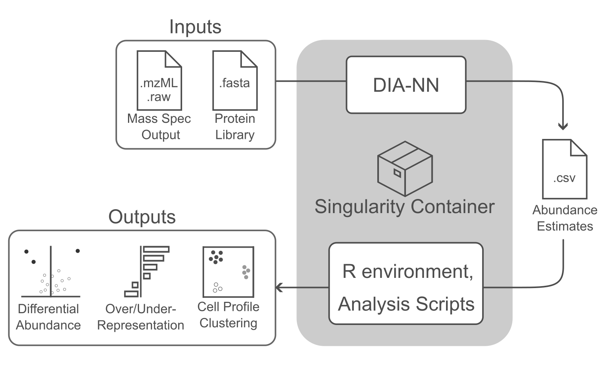

# README



This repository facilitates quick, simple, and reproducible access to Data Independent Acquisition (DIA) proteomics workflows with minimal command line experience.

We include a convenient wrapper script for running DIA-NN inside a pre-built singularity image to first estimate protein abundance from raw mass spec output. Protein abundance estimates (accepting estimates from both `DIA-NN` and `Spectronaut`) can  be processed in a preconfigured R environment, generating QC reports, and various analyses and visualizations.


# Quick-start

1. Ensure `singularity` is installed and accessible on your system. Many HPCs (including NIH Biowulf) come with this pre-installed as a module. If your HPC has singularity installed, it will be automatically detected and loaded when necessary.
2. Clone this repository, i.e. execute `git clone https://github.com/cory-weller/ProtPipe.git`
3. If you are predicting protein abundances from raw mass spec output, look over and edit any custom `DIA-NN` parameters inside [`config.txt`](config.txt). You can either edit `config.txt` directly (and it will be used by default), or make a copy and save it to a different file name, then reference it with `--cfg newfilename.txt` when running the wrapper script.


# Installing Singularity

This workflow requires that [`Singularity`](https://sylabs.io/singularity) be available, which runs natively on a Linux system. `Singularity` is containerization software that allows an entire pre-configured computing environment to be accessed--reducing installation headaches and improving reproducibility. 

*We highly recommend making use a workstation or HPC with a native Linux installation.* Not only does this simplify the usage of `singularity`, it also would likely provide greater resources for DIA-NN's intensive computation.

To run on your personal/local non-Linux machine, Mac users need to first install a number of dependencies. Windows users would either need to use a virtual machine, or run things through the Windows Subsystem for Linux (WSL). Explaining the installation of `singularity` on these non-Linux systems is beyond the scope of this guide, so we defer to [the documentation here](https://docs.sylabs.io/guides/3.0/user-guide/installation.html).

# Predicting Protein Abundances (running DIA-NN)
After editing the contents of [`config.txt`](config.txt), or generating a new file to specify with `--cfg newfile.txt`:
```bash
# Submit to SLURM
sbatch src/diann.sh --cfg config.txt

# Run Locally
src/diann.sh --cfg config.txt
```

# Processing protein intensity estimates

```bash
src/analyze.sh --pgfile TEST/report.pg_matrix.tsv --design TEST/design.tsv --out TEST/
```

<details><summary>Samples for Allison's CARD challenge</summary>

```bash
# WITH EMV samples, EMV as control
src/analyze.sh \
    --pgfile ANXA11/DIANN_PGs_with_EMV.tsv \
    --design ANXA11/EMV_as_control.tsv \
    --out ANXA11/with_EMV_vs_EMV \
    --sds 4 \
    --normalize shift \
    --base 2 \
    --labelgene ANXA11

# WITH EMV samples, WT as control
src/analyze.sh \
    --pgfile ANXA11/DIANN_PGs_with_EMV.tsv \
    --design ANXA11/WT_as_control.tsv \
    --out ANXA11/with_EMV_vs_WT \
    --sds 4 \
    --normalize shift \
    --base 2 \
    --labelgene ANXA11

# WITHOUT EMV samples, WT as control
src/analyze.sh \
    --pgfile ANXA11/DIANN_PGs_no_EMV.tsv \
    --design ANXA11/WT_as_control.tsv \
    --out ANXA11/no_EMV_vs_WT \
    --sds 4 \
    --normalize shift \
    --base 2 \
    --labelgene ANXA11

# Original Spectronaut, WT as control
src/analyze.sh \
    --pgfile ANXA11/spectronaut/ANXA11_Protein_Intensity.csv \
    --design ANXA11/WT_as_control.tsv \
    --out ANXA11/spectronaut \
    --sds 4 \
    --normalize shift \
    --base 2 \
    --labelgene ANXA11

# Neurons, A70 as control
src/analyze.sh \
    --pgfile ANXA11/neurons/neurons.tsv \
    --design ANXA11/designs/neuron_vs_A70.tsv \
    --out ANXA11/neurons \
    --sds 4 \
    --normalize shift \
    --base 2 \
    --labelgene ANXA11

# Microglia, A70 as control
src/analyze.sh \
    --pgfile ANXA11/microglia/microglia.tsv \
    --design ANXA11/designs/microglia_vs_A70.tsv \
    --out ANXA11/microglia \
    --sds 4 \
    --normalize shift \
    --base 2 \
    --labelgene ANXA11

# Neurons, 140 as control
src/analyze.sh \
    --pgfile ANXA11/neurons/neurons.tsv \
    --design ANXA11/designs/neuron_vs_140.tsv \
    --out ANXA11/neurons \
    --sds 4 \
    --normalize shift \
    --base 2 \
    --labelgene ANXA11

# Microglia, 140 as control
src/analyze.sh \
    --pgfile ANXA11/microglia/microglia.tsv \
    --design ANXA11/designs/microglia_vs_140.tsv \
    --out ANXA11/microglia \
    --sds 4 \
    --normalize shift \
    --base 2 \
    --labelgene ANXA11
```

</details>

## Converting Mass Spec file formats

DIA-NN cannot handle some propietary file formats such as thermo fisher RAW. Thus these files must
be converted (i.e. to mzML) prior to running DIA-NN. Conversion can be done interactively or by
submitting to your HPC with `sbatch`.

Converting a single file:
```bash
src/pwiz-convert /path/to/your/MassSpecFile.raw
```

Mass spec file conversion is handled by ProteoWizard (via wine in a singularity container).
A writable sandboxed version of the container (which is required to run ProteoWizard) was built
and modified from a [docker image](docker://chambm/pwiz-skyline-i-agree-to-the-vendor-licenses) on
March 02 2023. Steps were modified from [here](https://github.com/jspaezp/elfragmentador-data#setting-up-msconvert-on-singularity-).

<details><summary>Building pwiz container</summary>


```bash
# Build writable singularity sandbox image based on docker image
singularity build --sandbox pwiz_sandbox docker://chambm/pwiz-skyline-i-agree-to-the-vendor-licenses

# Modified pwiz_sandbox/usr/bin/mywine
echo """#!/bin/sh

GLOBALWINEPREFIX=/wineprefix64
MYWINEPREFIX=/mywineprefix/

if [ ! -L "$MYWINEPREFIX"/dosdevices/z: ] ; then 
  mkdir -p "$MYWINEPREFIX"/dosdevices
  cp "$GLOBALWINEPREFIX"/*.reg "$MYWINEPREFIX"
  ln -sf "$GLOBALWINEPREFIX/drive_c" "$MYWINEPREFIX/dosdevices/c:"
  ln -sf "/" "$MYWINEPREFIX/dosdevices/z:"
  echo disable > $MYWINEPREFIX/.update-timestamp        # Line being added
  echo disable > $GLOBALWINEPREFIX/.update-timestamp    # Line being added
fi 

export WINEPREFIX=$MYWINEPREFIX
wine "$@"
""" > pwiz_sandbox/usr/bin/mywine

tar -czvf pwiz_sandbox.tar.gz pwiz_sandbox
rclone copy pwiz_sandbox.tar.gz onedrive:/singularity       # upload archive to cloud
```
</details>

# Bulk convert raw to mzml
```bash
filelist='rawfiles.txt'
cat <(find ANXA11_redux | grep raw) > ${filelist}
nfiles=$(wc -l ${filelist} | awk '{print $1}')
sbatch --array=1-${nfiles} src/pwiz-convert-array.sh ${filelist}
```
