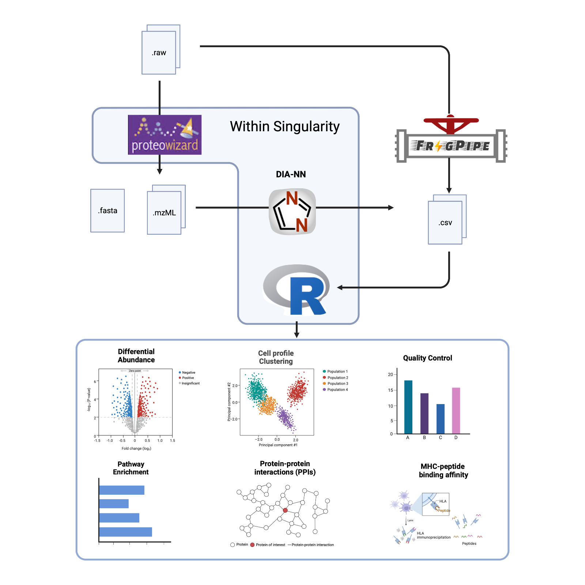

# README



This repository facilitates quick, simple, and reproducible access to Data Independent Acquisition (DIA) proteomics workflows with minimal command line experience.

We include a convenient wrapper script for running DIA-NN inside a pre-built singularity image to first estimate protein abundance from raw mass spec output. Protein abundance estimates (accepting estimates from both `DIA-NN` and `Spectronaut`) can  be processed in a preconfigured R environment, generating QC reports, and various analyses and visualizations.


# Quick-start

1. Ensure `singularity` is installed and accessible on your system. Many HPCs (including NIH Biowulf) come with this pre-installed as a module. If your HPC has singularity installed, it will be automatically detected and loaded when necessary.
2. Clone this repository, i.e. execute `git clone https://github.com/NIH-CARD/ProtPipe`
3. If you are predicting protein abundances from raw mass spec output, look over and edit any custom `DIA-NN` parameters inside [`config.txt`](config.txt). You can either edit `config.txt` directly (and it will be used by default), or make a copy and save it to a different file name, then reference it with `--cfg newfilename.txt` when running the wrapper script.


# Installing Singularity

This workflow requires that [`Singularity`](https://sylabs.io/singularity) be available, which runs natively on a Linux system. `Singularity` is containerization software that allows an entire pre-configured computing environment to be accessed--reducing installation headaches and improving reproducibility. 

*We highly recommend using a workstation or HPC with a native Linux installation.* Not only does this simplify the usage of `singularity`, it also would likely provide greater resources for DIA-NN's intensive computation.

To run on your personal/local non-Linux machine, Mac users need to first install a number of dependencies. Windows users would either need to use a virtual machine, or run things through the Windows Subsystem for Linux (WSL). Explaining the installation of `singularity` on these non-Linux systems is beyond the scope of this guide, so we defer to [the documentation here](https://docs.sylabs.io/guides/3.0/user-guide/installation.html).

# Predicting Protein Abundances (running DIA-NN)
After editing the contents of [`config.txt`](config.txt), or generating a new file to specify with `--cfg newfile.txt`:
```bash
# Submit to SLURM
sbatch src/diann.sh --cfg config.txt

# Run Locally
src/diann.sh --cfg config.txt
```

# Post-analysis

## Running containerized interactive `R` session
You can start an interactive R session within the container as follows:

```bash
./protpipe.sh R
```

The above is shorthand for executing the followiing:
```bash
singularity exec -B ${PWD} R
```

where `singularity exec R` starts the `R` session, while `-B ${PWD}` binds the
current directory within the container. Without binding, the current directory's
files would not be visible inside the container.

## Basic MS data analysis: `./protpipe.sh basic`

For performing QC and running differential abundance or enrichment analysis for typical mass spec data. The required inputs are
- protein intensity estimates from DIA-NN or Spectronaut
- experimental design matrix csv file

```bash
./protpipe.sh basic \
    --pgfile EXAMPLES/DIFF_ABUNDANCE/iPSC.csv \
    --design EXAMPLES/DIFF_ABUNDANCE/design_matrix_iPSC.csv \
    --out EXAMPLES/DIFF_ABUNDANCE/
```


## Affinity Purification Mass Spec analysis: `./protpipe.sh APMS`

Similar to `basic` but for affinity purification mass spec. Requires the user to specify which protein was used for pulldown (`--ip`)
```bash
./protpipe.sh APMS \
    --pgfile EXAMPLES/APMS/APMS.csv \
    --design EXAMPLES/APMS/design_matrix_APMS.csv \
    --ip UNC13A \
    --out EXAMPLES/APMS/
```

## Immunopeptidome analysis: `./protpipe.sh immuno`

Requires the csv or tsv output from `FragPipe` and a `csv` specifying HLA typing.
```bash
./protpipe.sh immuno \
    --pepfile EXAMPLES/IMMUNOPEPTIDOME/combined_peptide.tsv \
    --out EXAMPLES/IMMUNOPEPTIDOME/ \
    --hla EXAMPLES/IMMUNOPEPTIDOME/HLA_typing.csv
```


## Converting Mass Spec file formats

DIA-NN cannot handle some propietary file formats such as thermo fisher RAW. Thus these files must
be converted (i.e. to mzML) prior to running DIA-NN. Conversion can be done interactively or by
submitting to your HPC with `sbatch`.

Converting a single file:
```bash
outdir='mzML'
mkdir ${outdir}
bash src/pwiz-convert.sh /path/to/your/MassSpecFile.raw ${outdir}

```

Mass spec file conversion is handled by ProteoWizard (via wine in a singularity container).
A writable sandboxed version of the container (which is required to run ProteoWizard) was built
and modified from a [docker image](docker://chambm/pwiz-skyline-i-agree-to-the-vendor-licenses) on
March 02 2023. Steps were modified from [here](https://github.com/jspaezp/elfragmentador-data#setting-up-msconvert-on-singularity-).

<details><summary>Building pwiz container</summary>


```bash
# Build writable singularity sandbox image based on docker image
singularity build --sandbox pwiz_sandbox docker://chambm/pwiz-skyline-i-agree-to-the-vendor-licenses

# Modified pwiz_sandbox/usr/bin/mywine
echo """#!/bin/sh

GLOBALWINEPREFIX=/wineprefix64
MYWINEPREFIX=/mywineprefix/

if [ ! -L "$MYWINEPREFIX"/dosdevices/z: ] ; then 
  mkdir -p "$MYWINEPREFIX"/dosdevices
  cp "$GLOBALWINEPREFIX"/*.reg "$MYWINEPREFIX"
  ln -sf "$GLOBALWINEPREFIX/drive_c" "$MYWINEPREFIX/dosdevices/c:"
  ln -sf "/" "$MYWINEPREFIX/dosdevices/z:"
  echo disable > $MYWINEPREFIX/.update-timestamp        # Line being added
  echo disable > $GLOBALWINEPREFIX/.update-timestamp    # Line being added
fi 

export WINEPREFIX=$MYWINEPREFIX
wine "$@"
""" > pwiz_sandbox/usr/bin/mywine

tar -czvf pwiz_sandbox.tar.gz pwiz_sandbox
rclone copy pwiz_sandbox.tar.gz onedrive:/singularity       # upload archive to cloud
```
</details>

# Bulk convert raw to mzml

First, create `rawfiles.txt` that contains all `.raw` files to convert (one per line)

For example:
```bash
# Define file name
filelist='rawfiles.txt'
outdir='mzML'
mkdir ${outdir}

# find all files within the folder `ANXA11_redux` and print to file
cat <(find ANXA11_redux | grep raw) > ${filelist}

# get number of files
nfiles=$(wc -l ${filelist} | awk '{print $1}')

# Submit array, one per file
sbatch --array=1-${nfiles} src/pwiz-convert-array.sh ${filelist} ${outdir}
```
